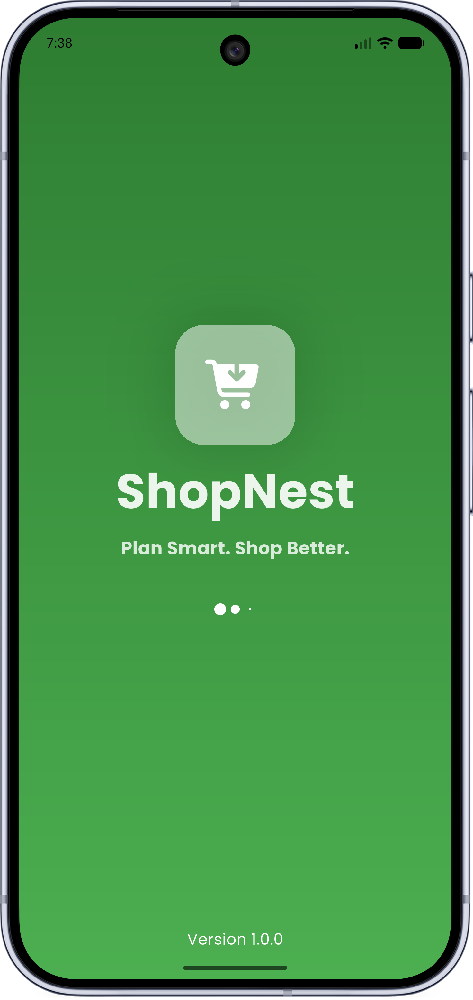
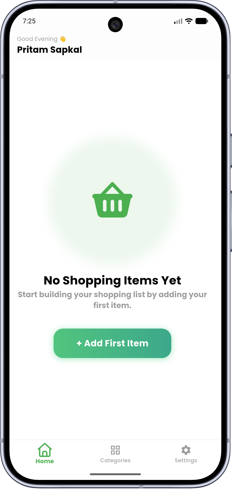
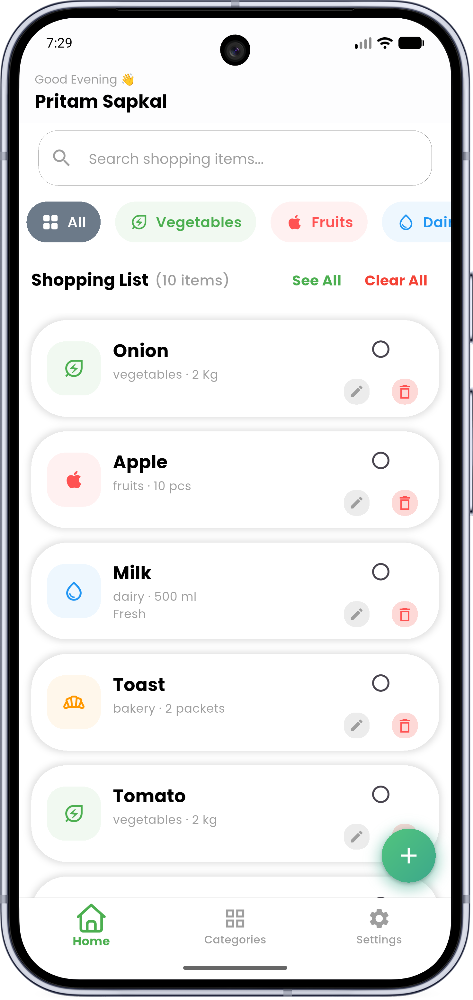
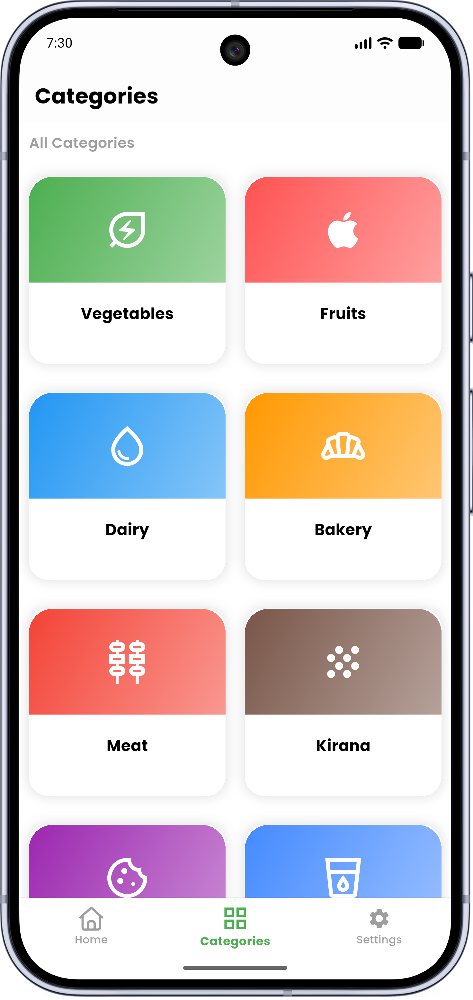
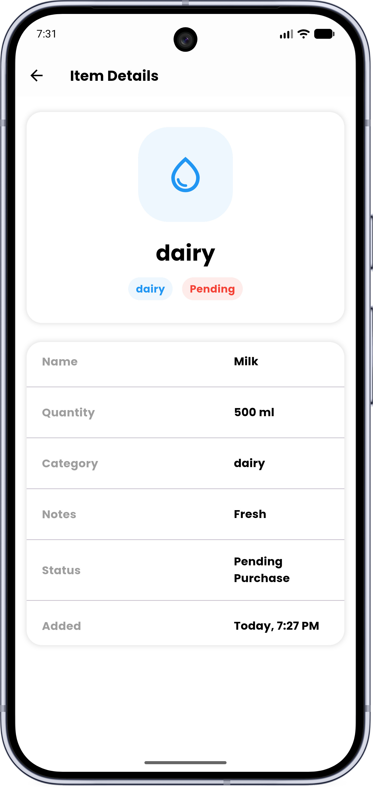
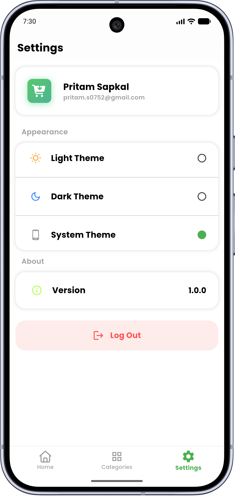
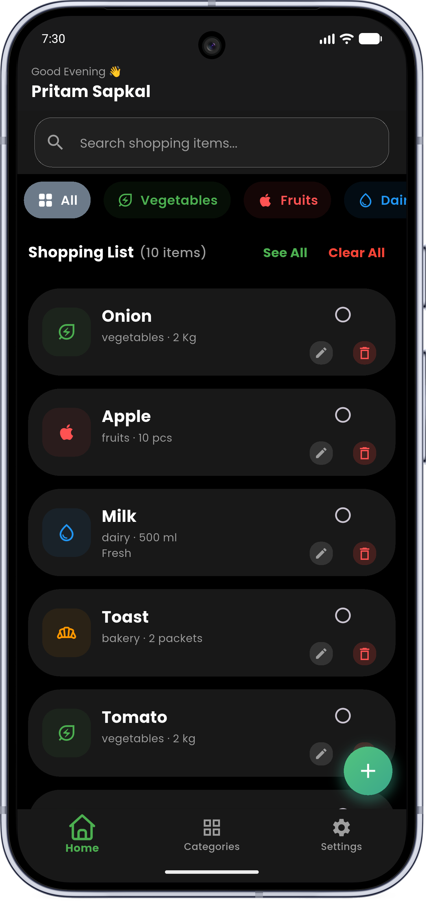
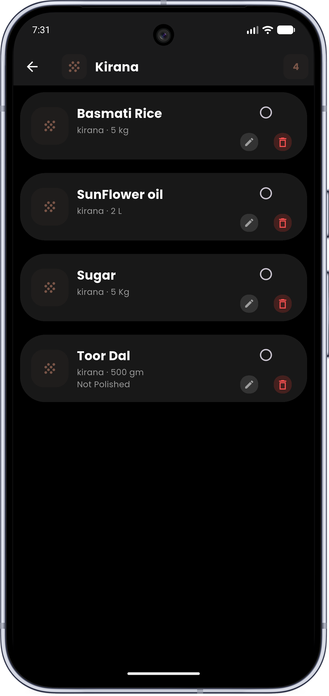
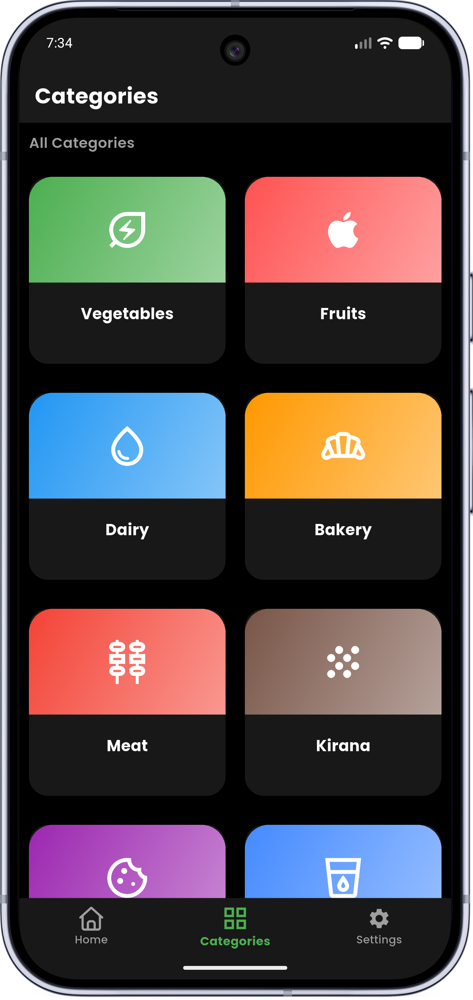
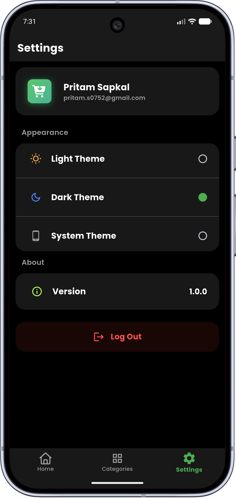

<div align="center">

# 🛍️ ShopNest

### Offline-First Grocery & Shopping List Management Mobile App

<p>
  <b>Plan Smart • Organize Faster • Shop Better</b>
</p>

<p>
  <a href="https://github.com/PritamSapkal/ShopNest/releases/download/V1.0.0/ShopNest_V1.0.0.apk">
    
  </a>
  &nbsp;
  <a href="https://github.com/PritamSapkal/ShopNest/releases/tag/V1.0.0">
    
  </a>
</p>

<p>
  
  
  
  
  
  
</p>

</div>

---

## 📖 Overview

**ShopNest** is a fast, lightweight, and offline-first mobile application designed to simplify daily grocery runs, pantry restocking, and shopping list organization. Built with **Flutter**, **Riverpod**, and **Hive**, the app guarantees zero network latency by storing and querying all data locally on-device.

From dynamic category filtering and real-time search queries to multi-theme toggles and purchase status tracking, ShopNest demonstrates scalable architecture patterns, reactive UI state management, and modern Material 3 design principles.

---

## 📸 Application Showcase

<div align="center">

### ☀️ Light Mode Experience

|                            Splash & Onboarding                             |                              Empty State                               |                              Dashboard & Search                              |
|:--------------------------------------------------------------------------:|:----------------------------------------------------------------------:|:----------------------------------------------------------------------------:|
|  |  |  |

|                                Category Hub                                |                              Item Details                               |                                  Settings & Profile                                   |
|:--------------------------------------------------------------------------:|:-----------------------------------------------------------------------:|:-------------------------------------------------------------------------------------:|
|  |  |  |

### 🌙 Dark Mode Experience

|                             Dark Dashboard                              |                             Filtered Search                              |                                Dark Category Hub                                |                                 Settings & Profile                                  |
|:-----------------------------------------------------------------------:|:------------------------------------------------------------------------:|:-------------------------------------------------------------------------------:|:-----------------------------------------------------------------------------------:|
|  |  |  |  |

</div>

---

## ✨ Key Features

<table>
<tr>
<td width="50%" valign="top">

### 🛒 Core Shopping & CRUD
* **Effortless Item Creation:** Add items with name, category, quantity unit (`kg`, `pcs`, `g`, `L`), and optional notes.
* **Instant Edit & Delete:** Seamlessly update item attributes or delete redundant entries in real time.
* **Purchase Status Tracking:** Interactive check toggles to differentiate pending vs. purchased grocery items.
* **Detailed Item View:** Comprehensive modal inspecting metadata, notes, timestamp, and purchase status.

</td>
<td width="50%" valign="top">

### 🔍 Discovery & Filtering
* **Real-Time Live Search:** Fast item query matching across your entire database.
* **Horizontal Filter Chips:** One-tap filtering by category (Vegetables, Fruits, Dairy, Kirana, etc.).
* **Category Grid Hub:** Dedicated tab providing high-level category cards with item counts.
* **Quick Reset Actions:** Instant "See All" and "Clear All" batch operations.

</td>
</tr>
<tr>
<td width="50%" valign="top">

### ⚡ Offline-First Architecture
* **Hive NoSQL Storage:** High-performance, lightweight key-value database running entirely locally.
* **Riverpod State Management:** Fully reactive providers ensuring zero UI lag and clean separation of concerns.
* **Session Persistence:** User profile info and settings saved via `SharedPreferences`.

</td>
<td width="50%" valign="top">

### 🎨 UI & User Experience
* **Dynamic Theming:** Seamless switching between **Light Theme**, **Dark Theme**, and **System Default**.
* **Zero-State Handling:** Illustrated empty screen guiding users to add their first grocery item.
* **Safe Logout Protocol:** Guarded confirmation dialog preventing accidental local data loss.

</td>
</tr>
</table>

---

## 🛠️ Tech Stack & Dependencies

| Tool / Package | Purpose |
| :--- | :--- |
| **[Flutter](https://flutter.dev/)** | Cross-platform UI toolkit |
| **[Dart](https://dart.dev/)** | Core programming language |
| **[flutter_riverpod](https://pub.dev/packages/flutter_riverpod)** | Compile-safe reactive state management |
| **[hive_flutter](https://pub.dev/packages/hive_flutter)** | Ultra-fast on-device NoSQL storage |
| **[shared_preferences](https://pub.dev/packages/shared_preferences)** | Persistent storage for theme flags and user session |
| **[google_fonts](https://pub.dev/packages/google_fonts)** | Clean typography and styling |
| **[flutter_screenutil](https://pub.dev/packages/flutter_screenutil)** | Adaptive and responsive UI layout |

---

## 📂 Project Architecture

```text
lib/
├── core/
│   ├── constants/          # Colors, strings, asset paths, category definitions
│   ├── theme/              # Light and Dark theme configurations
│   └── utils/              # Dialogs, snackbars, and formatters
├── models/                 # Hive TypeAdapters and item data models
├── providers/              # Riverpod StateNotifiers, theme & item providers
├── services/               # Hive storage managers and local preferences wrapper
├── views/
│   ├── onboarding/         # Splash, Intro carousel, and Welcome screen
│   ├── home/               # Dashboard, Search bar, Category chips, and Item cards
│   ├── categories/         # Category grid screen & isolated category lists
│   ├── details/            # Detailed item modal / sheet
│   └── settings/           # Profile summary, theme selector, and logout dialog
└── main.dart               # App initialization and Hive box registration